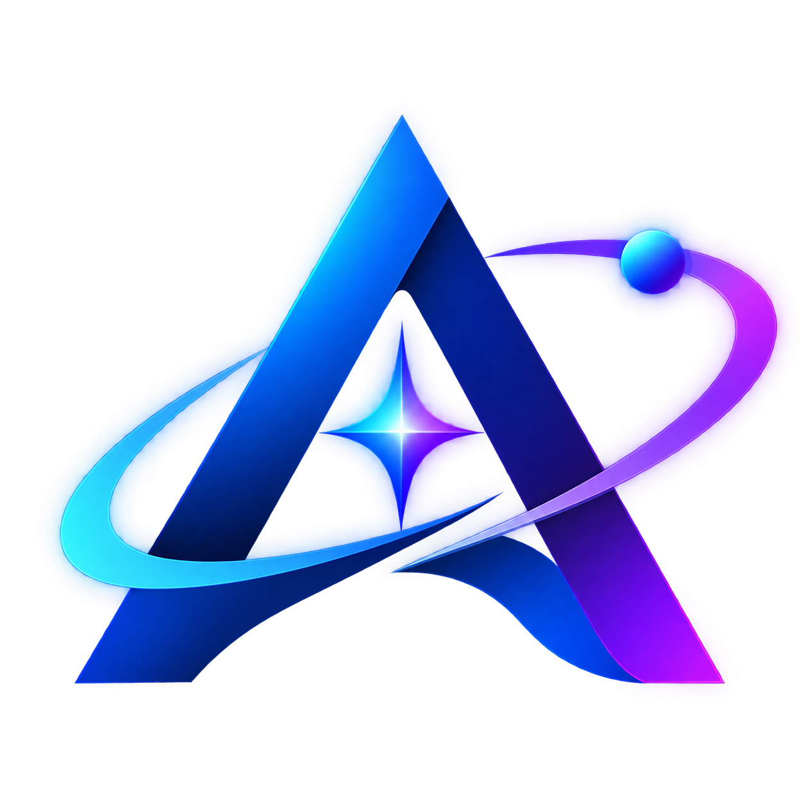
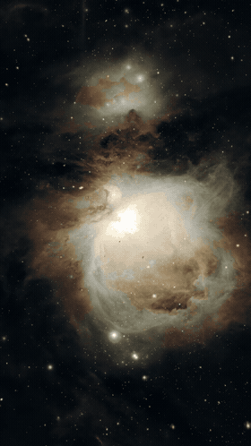
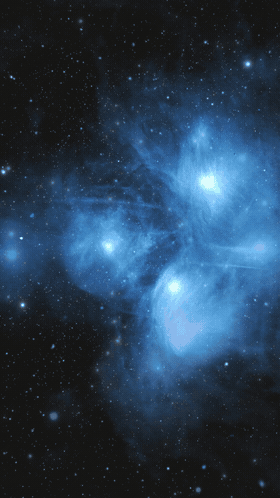

<p align="center">
  
</p>

# AstroMotion

**AstroMotion v1.2** erstellt cinematische Deep-Sky-Videos aus fertig bearbeiteten Astrofotos. Sterne und Nebel werden nach **echter StarNet2-Sterntrennung** unabhängig animiert, mit perspektivischem Sternflug, sanfter Rotation, Ambient-Musik und nahtlosem Loop. **Cinematic Intelligence** ergänzt intelligenten Kamerafokus, vorsichtige Farbanpassung und adaptive künstlerische Sterntiefen.

**Keine approximative OpenCV-Sterntrennung und keine künstlichen Demo-Sterne.** Benötigt wird die separat installierte **StarNet2-CLI** oder eine passende, bereits mit StarNet erzeugte Starless-Datei. Die Sternentfernungen sind künstlerisch und keine astrophysikalische Messung. Python 3.11+ (3.12 empfohlen), OpenCV, NumPy, FFmpeg; Windows, Linux und macOS.

## TL;DR – schnell zum ersten Video

1. **Direkt anschauen:** [Orionnebel-Video](examples/real/orion_starnet_demo.mp4) oder [Plejaden-Video](examples/real/pleiades_starnet_demo.mp4).
2. **Installieren:** Python 3.12, FFmpeg und die offizielle [StarNet2-CLI](https://starnetastro.com/cli-tools/starnet/) (Lizenz selbst akzeptieren). Windows: `setup_windows.bat`; Linux/macOS: [Einrichtung](#1-einrichtung).
3. **Eigenes Foto rendern** (Pfad zu StarNet2 anpassen):

```bash
python main.py --input Orion.jpg --starnet "/pfad/zu/starnet2" --config configs/cinematic_intelligence.yaml --duration 30 --output Orion_video.mp4
```

**Vorhandenes echtes Starless:** `--starless Orion_starless.tif` statt `--starnet`.
Dauer frei wählbar: `--duration 45`. Zufällige Ambient-Musik ist Standard;
`--seed 1234` fixiert die Variante. Zum Ersetzen eines bestehenden Exports `--overwrite` setzen.

## Demos mit echter StarNet2-Sterntrennung

Die Fotos stammen von mir, aufgenommen mit **Seestar S50 Pro** und bearbeitet mit **AstroWizard**.

| Orionnebel · M42 | Plejaden · M45 |
|---|---|
| [](examples/real/orion_starnet_demo.mp4) | [](examples/real/pleiades_starnet_demo.mp4) |
| [Originalfoto](examples/real/orion.jpg) · [MP4 mit Musik](examples/real/orion_starnet_demo.mp4) | [Originalfoto](examples/real/pleiades.jpg) · [MP4 mit Musik](examples/real/pleiades_starnet_demo.mp4) |

**30 Sekunden, 1080 × 1920, 30 FPS, H.264 + AAC.** Die GIF-Vorschauen laufen direkt in der README und sind stumm. Musik wird lokal neu erzeugt, ohne Samples fremder Aufnahmen.

**Beide Videos lokal mit echter StarNet2-CLI neu rendern:**

```bash
python scripts/render_starnet_examples.py --starnet "/pfad/zu/starnet2" --overwrite
```

Optional: `--only pleiades`, `--duration 45`, `--seed 1234`.
Nur der [StarNet2-Demo-Workflow](.github/workflows/starnet-demos.yml)
rendert die öffentliche Galerie auf GitHub. Er lädt StarNet2 direkt
vom offiziellen Anbieter, prüft Versions- und Lizenzrevision und veröffentlicht
MP4/GIF erst nach erfolgreichem Render und technischen Checks.

Siehe [Medienhinweise](examples/real/README.md) und
[Lizenzhinweise](THIRD_PARTY_NOTICES.md).

### AstroMotion v1.2 – Cinematic Intelligence

Das Preset [`configs/cinematic_intelligence.yaml`](configs/cinematic_intelligence.yaml)
aktiviert den intelligenten Kamerafokus, sanfte bildabhängige
Kontrast-/Sättigungsanpassung und einen adaptiv verteilten Sternflug.
Sternhelligkeit dient dabei **nur als künstlerischer Tiefenhinweis**,
nicht als astronomische Entfernungsmessung.

```bash
# Mit einer echten Starless-Datei
python main.py --input orion.jpg --starless orion_starless.tif --config configs/cinematic_intelligence.yaml --output orion_v12.mp4

# Mit StarNet2 statt separatem Starless
python main.py --input orion.jpg --starnet "/path/to/starnet2" --config configs/cinematic_intelligence.yaml --output orion_v12.mp4

# Schnelle Vorschau: 3 Sekunden, 720p, 24 FPS
python main.py --input orion.jpg --starless orion_starless.tif --config configs/cinematic_intelligence.yaml --preview --output orion_preview.mp4
```

Alternativ zu einem Preset können `--auto-focus`, `--auto-color`
und `--depth-mode adaptive` individuell aktiviert werden.
Standardmäßig bleiben alle neuen intelligenten Anpassungen
**aus**, damit bisherige Ergebnisse unverändert bleiben.
Farben werden immer nur dezent angepasst; das Originalfoto bleibt
unberührt. Die automatisch ausgewählten Parameter stehen im Renderbericht.

**Im Repository:** vollständiger Python-Quellcode, Presets und YAML-/JSON-Beispiele,
Windows-Startdateien, Tests sowie die beiden eigenen Seestar-Fotos mit echten
StarNet2-Videos und GIFs. StarNet2 selbst und seine Modellgewichte werden
nicht mitgeliefert.

**Historische Testgrenze:** Unter Linux/Python 3.12 bestanden ursprünglich 58 Tests, einschließlich echter
FFmpeg-Exporte. macOS wurde hier bisher nicht ausgeführt. Die echte
StarNet2-CLI 2.6.2 wurde inzwischen nach Zustimmung zu ihrer Lizenz lokal ausgeführt,
einschließlich 2×-Verarbeitung. Windows-Batchdateien und der Windows-Build müssen
auf deinem Windows-Rechner getestet werden. Details in `TEST_REPORT.md`.

## 1. Einrichtung

| Plattform | Einstieg |
|---|---|
| Windows 11 x64 | [Windows einrichten](#11-windows-11) |
| Linux | [Linux einrichten](#12-linux-ubuntu--debian) |
| macOS | [macOS einrichten](#13-macos-intel-und-apple-silicon) |

### 1.1 Windows 11

1. Repository klonen oder über **Code → Download ZIP** herunterladen und vollständig
   entpacken, z. B. nach `C:\AstroMotion`. Nicht direkt im ZIP starten.
2. 64-Bit-Python **3.11 oder neuer** von https://www.python.org/downloads/windows/
   installieren, inklusive Python Launcher (`py`). Python 3.11/3.12 sind die
   empfohlenen Versionen für diese gepinnten Wheels. Bei neuerem Python müssen
   passende Wheels verfügbar sein; getestet wurde 3.12.
3. `setup_windows.bat` doppelklicken. Es erstellt eine lokale `.venv` und installiert
   exakt die Versionen aus `requirements.txt`. Einmaliger Internetzugang nötig.
4. FFmpeg mit `libx264` und FFprobe installieren. Windows-Links:
   https://ffmpeg.org/download.html#build-windows (z. B. Gyan oder BtbN).
   Das `bin`-Verzeichnis zu PATH hinzufügen und ein neues Terminal öffnen.
   Alternativ absolute Pfade unter `encoding.ffmpeg`/`encoding.ffprobe` in YAML setzen.

In CMD prüfen:

```bat
py -3 --version
ffmpeg -version
ffprobe -version
ffmpeg -hide_banner -encoders | findstr libx264
```

Manuelle Python-Installation statt Batchdatei:

```bat
cd /d C:\AstroMotion
py -3 -m venv .venv
.venv\Scripts\python.exe -m pip install -r requirements.txt
```

### 1.2 Linux (Ubuntu / Debian)

Die folgenden Paketbefehle gelten für Ubuntu/Debian mit Python **3.11 oder neuer**, beispielsweise Ubuntu 24.04 mit Python 3.12. Bei anderen Distributionen die entsprechenden Pakete mit deren Paketmanager installieren: Python mit venv/pip, Git und FFmpeg/FFprobe mit libx264. Für Beschriftungen wird eine TrueType-Schrift benötigt.

Systempakete installieren und die Python-Version prüfen:

```bash
sudo apt update
sudo apt install python3 python3-venv python3-pip git ffmpeg fonts-dejavu-core
python3 --version
```

Python 3.12 ist der hier getestete Stand. Falls `python3` noch Python 3.10 oder eine neuere, von den gepinnten Wheels nicht unterstützte Version startet, zuerst eine passende Python-Version installieren und die venv ausdrücklich mit `python3.12 -m venv .venv` erstellen.

```bash
git clone https://github.com/nosTa1337/AstroMotion.git
cd AstroMotion
python3 -m venv .venv
source .venv/bin/activate
python -m pip install --upgrade pip
python -m pip install -r requirements.txt
```

Mit `python` wird jetzt der Interpreter der aktivierten Umgebung verwendet. Die Pakete bleiben in der lokalen venv. Bei `externally-managed-environment` die venv aktivieren und erneut `python -m pip` verwenden.

### 1.3 macOS (Intel und Apple Silicon)

[Homebrew](https://brew.sh/) installieren, falls es noch fehlt, und dessen Einrichtung für PATH abschließen. Anschließend in einem neuen Terminal:

```bash
brew install python@3.12 ffmpeg git
python3.12 --version
git clone https://github.com/nosTa1337/AstroMotion.git
cd AstroMotion
python3.12 -m venv .venv
source .venv/bin/activate
python -m pip install --upgrade pip
python -m pip install -r requirements.txt
```

Python 3.12 wird ausdrücklich ausgewählt, damit ein Homebrew-Update des Standardbefehls `python3` nicht versehentlich eine andere Python-Version für die venv verwendet. Die festen Paketversionen benötigen passende Wheels für deine macOS-Version und CPU.

Auf **Apple Silicon** (M-Serie) eine native ARM64-Python-/Homebrew-Installation verwenden; auf **Intel-Macs** die x86-64-Komponenten. Architektur prüfen:

```bash
uname -m
python -c "import platform; print(platform.machine())"
```

Bei nativer Ausführung sollten beide Ausgaben dieselbe Architektur zeigen: `arm64` auf Apple Silicon bzw. `x86_64` auf Intel. Für StarNet ebenfalls das passende native Paket wählen.

Die Windows-Dateien `setup_windows.bat` und `start_windows.bat` werden unter Linux und macOS durch die Terminalbefehle in dieser Anleitung ersetzt. macOS wurde hier bisher nicht ausgeführt.

Für automatische Texteinblendungen und die Caption-Tests kann optional DejaVu Sans installiert werden. Pillow sucht unter macOS auch im lokalen Fontordner:

```bash
brew install --cask font-dejavu-sans
python -c "from PIL import ImageFont; ImageFont.truetype('DejaVuSans.ttf', 24); print('Schrift OK')"
```

Alternativ für eigene Exporte `caption.font` setzen, siehe Abschnitt 3.

### 1.4 Installation prüfen und später erneut starten

Unter Linux/macOS aus dem Projektordner mit aktivierter venv:

```bash
python --version
python -c "import cv2, numpy, PIL, yaml, tifffile; print('Python-Pakete OK')"
ffmpeg -version
ffprobe -version
ffmpeg -hide_banner -encoders 2>/dev/null | grep libx264
python main.py --help
python main.py --config configs/immersive_loop.yaml --print-config
```

Die Encoderliste muss `libx264` enthalten. FFmpeg und FFprobe müssen in PATH liegen oder mit absoluten Pfaden unter `encoding.ffmpeg` / `encoding.ffprobe` in der Konfiguration stehen.

Nach dem Schließen des Terminals die Umgebung erneut aktivieren:

```bash
cd /pfad/zu/AstroMotion
source .venv/bin/activate
```

Alternativ ohne Aktivierung direkt `.venv/bin/python main.py ...` verwenden. `deactivate` verlässt die venv. Für ein Update `git pull` und danach `python -m pip install -r requirements.txt` in der aktivierten Umgebung ausführen.

## 2. Erste StarNet2-Demo

[Orionnebel](examples/real/orion_starnet_demo.mp4) und
[Plejaden](examples/real/pleiades_starnet_demo.mp4) können sofort angesehen
werden. Mit der offiziell installierten StarNet2-CLI lassen sich die beiden
30-Sekunden-Videos samt GIFs und neuer Ambient-Musik selbst rendern:

```bash
python scripts/render_starnet_examples.py --starnet "/pfad/zu/starnet2" --overwrite
```

Optionen: `--only orion`, `--only pleiades`, `--duration 45`,
`--seed 1234`. Es werden weder künstliche Beispielsterne noch
OpenCV-basierte Ersatztrennungen erzeugt.

## 3. Eigene Seestar-Aufnahmen

Verwende dein fertig bearbeitetes, gestretchtes RGB-Foto, idealerweise als sRGB-
16-Bit-TIFF/PNG. JPG funktioniert ebenfalls, enthält aber weniger Tonwertreserven.
Nicht die linearen FITS-Summenbilder direkt verwenden. 16-Bit-Quellen werden als
float32 verarbeitet; erst der H.264-Export wird auf 8 Bit reduziert.

### Variante A: Bereits vorhandenes sternenloses Bild

Original und Starless müssen dieselbe Größe, Ausrichtung, Streckung und Farben
haben. Starless nach der Sternentfernung **nicht separat** neu graden, beschneiden
oder stretchen. Keine automatische Registrierung oder Helligkeitsanpassung.

```bat
.venv\Scripts\python.exe main.py --input "D:\Astro\Orion.tif" --starless "D:\Astro\Orion_starless.tif" --preset cinematic --format vertical --duration 20 --music ambient --output "D:\Astro\Orion_video.mp4"
```

### Variante B: StarNet++ / StarNet2 lokal

1. **Standalone CLI** von https://starnetastro.com/cli-tools/starnet/ herunterladen;
   kein PixInsight-Modul. Vollständig entpacken/installieren und die Lizenz der
   konkreten Version lesen. Modelle, DLLs und Paketordner zusammen lassen.
2. Pfad zur EXE über `--starnet` oder `separation.executable` in `config.yaml` setzen.
   Aktuelle Pakete nennen die Datei `starnet2.exe`; ältere `starnet++.exe`.
3. `auto` erkennt den Modus am Dateinamen. Bei umbenannten EXEs explizit
   `--starnet-mode modern` oder `legacy` wählen.

```bat
.venv\Scripts\python.exe main.py --input "D:\Astro\Orion.png" --starnet "C:\Tools\StarNet2\starnet2.exe" --preset cinematic --format vertical --duration 20 --music ambient
```

Legacy:

```bat
.venv\Scripts\python.exe main.py --input orion.tif --starnet "C:\Tools\StarNetv2\starnet++.exe" --starnet-mode legacy --music ambient
```

Die Integration schreibt ein gestretchtes RGB-16-Bit-TIFF, startet StarNet ohne
Shell im Installationsverzeichnis und liest das erzeugte Starless. Modern nutzt
`--input/--output/--stride`; Legacy nutzt `INPUT OUTPUT STRIDE`. Keine fremden
Modelle werden heruntergeladen. Mindestens 512 × 512 Verarbeitungspixel nötig.
Ein gerader Stride von 256 ist Standard; kleinere Werte brauchen länger.
Moderne CLI optional `extra_args: ['--upsample']` für sehr kleine Sterne; dies
benötigt mehr RAM und Zeit. Nicht für alte CLI ungeprüft übernehmen.

Wenn StarNet fehlt, abstürzt oder ein unpassendes Bild liefert, bricht AstroMotion
ab. Es gibt keinen heuristischen Ersatz. StarNet-Ergebnis im `<video>_assets`
Ordner prüfen; bei Reststernen/Artefakten ein saubereres Starless verwenden.
Das Programm kann vorhandene Löcher oder falsch entfernte Nebeldetails nicht
zuverlässig reparieren. Siehe `THIRD_PARTY_NOTICES.md` für Lizenzgrenzen.

### Eigene Aufnahmen unter Linux / macOS

Die Optionen sind dieselben wie unter Windows. Pfade verwenden `/`; Leerzeichen in Datei- und Ordnernamen mit Anführungszeichen schützen. Beispiel mit vorhandenem Starless, 45 Sekunden und eigener Musik:

```bash
python main.py \
  --input "$HOME/Pictures/Astro/Orion.tif" \
  --starless "$HOME/Pictures/Astro/Orion_starless.tif" \
  --config configs/immersive_loop.yaml \
  --duration 45 \
  --audio "$HOME/Music/ambient.wav" \
  --output "$HOME/Pictures/Astro/Orion_loop.mp4"
```

Ohne eigene Musik die Zeile `--audio ...` weglassen: Das Loop-Profil erzeugt Ambient-Musik lokal. Für Ausgabe ohne Musik `--music none` setzen.

**StarNet2 für die Demos erforderlich:** Von der [offiziellen Downloadseite](https://starnetastro.com/cli-tools/starnet/) das passende CLI-Paket installieren und die Lizenz akzeptieren. Den vollständigen Paketordner mit Bibliotheken und Modellen zusammen lassen. Bei eigenen bereits vorhandenen, korrekt mit StarNet erzeugten Starless-Bildern ist ein weiterer StarNet-Lauf nicht erforderlich.

Beispiel für ein entpacktes aktuelles Paket im Ordner `$HOME/Tools/StarNet2`:

```bash
chmod +x "$HOME/Tools/StarNet2/starnet2"
python main.py \
  --input "$HOME/Pictures/Astro/Orion.tif" \
  --starnet "$HOME/Tools/StarNet2/starnet2" \
  --starnet-mode modern \
  --config configs/immersive_loop.yaml \
  --duration 30 \
  --output "$HOME/Pictures/Astro/Orion_loop.mp4"
```

Pfad und Programmname müssen zum heruntergeladenen Paket passen. Beim aktuellen nativen Installer liegt das Programm unter Linux typischerweise in `/usr/bin/starnet2`, unter macOS in `/usr/local/bin/starnet2`. Diese absoluten Pfade können stattdessen an `--starnet` übergeben werden. AstroMotion erwartet hier einen Dateipfad, keinen bloßen Befehlsnamen aus PATH. Aktuelle `starnet2`-Pakete nutzen `modern`, ältere `starnet++`-Pakete `legacy`.

**Texteinblendungen auf dem Mac:** Die automatische Fontsuche enthält bisher Windows-/DejaVu-Pfade. Wenn kein skalierbarer Font gefunden wird, in einer Kopie des gewünschten YAML-Profils eine vorhandene TTF/OTF-Datei angeben. Beispiel, falls diese Arial-Datei auf deinem Mac existiert:

```yaml
caption:
  enabled: true
  title: Orionnebel
  subtitle: MESSIER 42
  font: /System/Library/Fonts/Supplemental/Arial.ttf
```

Das Profil mit `--config` laden. Alternativ einen eigenen Fontpfad eintragen; die Existenz z. B. mit `ls "/pfad/zur/Schrift.ttf"` prüfen. Unter Linux deckt `fonts-dejavu-core` normalerweise die automatische Suche ab.

## 4. Bedienung und Presets

```bat
start_windows.bat --input orion.png --starless orion_starless.png --preset epic --music ambient
start_windows.bat --input orion.png --starless orion_starless.png --config configs\calm.yaml
start_windows.bat --input orion.png --starless orion_starless.png --config configs\custom.json
start_windows.bat --input orion.png --starless orion_starless.png --config configs\starflight.yaml
start_windows.bat --input orion.png --starless orion_starless.png --config configs\immersive.yaml
start_windows.bat --input orion.png --starless orion_starless.png --config configs\immersive_15s.yaml
```

Ein Foto auf `start_windows.bat` ziehen: nutzt `config.yaml` und den dort
eingetragenen StarNet-Pfad. Bei CLI-Argumenten setzt die Batchdatei keine
Konfiguration automatisch; `--config` ausdrücklich angeben.

| Preset | Nebelzoom über das Video | Gesamtrotation | Wirkung |
|---|---:|---:|---|
| cinematic | 6,5 % | 1,8° | Sanfte Parallax, subtile Effekte |
| epic | 10 % | 3,2° | Stärkere Bewegung und mehr Bloom |
| calm | 3 % | 0,65° | Ruhige Ambient-Ansicht |

Alle Zoomwerte gelten bei `speed: 1`. Das Preset ist eine Ausgangsbasis.
Reihenfolge: Defaults → gewähltes Preset → Konfigurationsdatei → CLI.
**Die vollständige `config.yaml` überschreibt die Motion-/Effektwerte eines
Presets ausdrücklich.** Für echte Preset-Defaults die Datei nicht angeben oder
die entsprechenden Sektionen entfernen. Minimalbeispiele stehen in `configs/`.

### Starflight: Sterne kommen auf die Kamera zu

`configs/starflight.yaml` hält die Nebelkamera vollständig still. Die Sternenebene
vergrößert sich in 10 Sekunden auf das 2,5-Fache und dreht sich dabei um insgesamt
4,5°. Damit dominiert die radiale Sternbewegung den räumlichen Eindruck. Das ist
ein bewusst kräftiger 2,5D-Flugeffekt, weiterhin aus den echten Bildsternen und
ohne erfundene zusätzliche Sterne.

Bei starkem Vordergrundzoom können farbige Nebelreste aus der neuronalen
Sternentfernung auffallen. Die optionale `separation.foreground_cleanup: true`
bevorzugt neutralere Sternkerne samt ihrem Umfeld als bewegten Vordergrund und
ordnet andere Differenzanteile wieder dem Hintergrund zu. Die unbewegte
Rekonstruktion bleibt erhalten. Sehr schwache oder stark farbige Sterne können
dadurch im ruhigen Hintergrund bleiben. Dies ist eine künstlerische Auswahl,
keine astronomisch sichere Klassifikation und kein Ersatz für StarNet.

### Immersive: Flug zwischen einzelnen Sternen

`configs/immersive.yaml` ist für den sichtbaren Flug durch einen Sternraum gedacht:
Der Nebel bleibt unbewegt, während einzelne Sterne nach X/Z und Y/Z projiziert
werden. Näher gelegene Sterne wachsen und bewegen sich schneller. Eine seitliche
Kamerafahrt erzeugt tiefenabhängige Parallax, dazu kommen 4° Rotation. Nahe Sterne
werden zuletzt über den Nebel gelegt; ihre hellen Kerne überdecken die Filamente.
Ein schwaches fernes Sternfeld bleibt im Hintergrund sichtbar.

Die Positionen und Farben werden aus erkannten Kernen der getrennten Sternebene
abgeleitet. Die Sterne werden als weiche Lichtpunkte neu gerendert und für einen
gleichmäßig gefüllten Raum räumlich verteilt. Ihre ursprüngliche Anordnung und
Sternprofile werden dabei verändert. Tiefen sind reproduzierbar mit Seed vergeben,
**keine gemessenen astronomischen Entfernungen**. Die klassische Ebenenanimation
bleibt mit `starfield.enabled: false` verfügbar.

| Parameter | Bedeutung im perspektivischen Modus |
|---|---|
| `starfield.enabled` | Einzelsternprojektion aktivieren |
| `starfield.count`, `seed` | Höchstzahl erkennbarer Sternkerne und reproduzierbare Tiefen |
| `starfield.near`, `far` | Vordere/hintere Grenze des künstlerischen Sternvolumens |
| `starfield.travel` | Vorwärtsstrecke über die gesamte Videodauer |
| `starfield.drift_x`, `drift_y` | Seitlicher Weg je Einheit Vorwärtsbewegung |
| `starfield.rotation_deg` | Gesamte Rotation des Sternraums |
| `starfield.farfield_gain` | Helligkeit der ursprünglichen flachen Sternebene |
| `starfield.foreground_gain` | Helligkeit der perspektivischen Sterne |
| `starfield.max_radius` | Maximale Gaußbreite in Pixeln bei 1080 Pixeln kurzer Kante |
| `starfield.shutter` | Dezente Bewegungsspur als Anteil eines Frameintervalls |

Auch dieser Flug beginnt und endet sanft. Sterne am nahen Rand werden ausgeblendet
und am hinteren Rand wieder eingeblendet, um sichtbare Sprünge zu vermeiden.
Die Regler unter `motion` steuern weiterhin die Nebelkamera und das ferne Sternfeld;
`motion.speed` beeinflusst nicht die unabhängige Vorwärtsstrecke des Sternvolumens.

`configs/immersive_15s.yaml` und `configs/immersive_blue.yaml` sind zwei Varianten
mit 15 Sekunden Länge und unterschiedlichen Ambient-Harmonien. Gegenüber dem
12-Sekunden-Profil ist die mittlere Kamerabewegung pro Sekunde um 5 % reduziert:
`travel: 2.85` und `rotation_deg: 4.75`. Das berücksichtigt die längere Laufzeit;
nur die Dauer zu erhöhen würde die Bewegung um 20 % verlangsamen. Tiefen und
seitliche Fahrt erzeugen weiterhin unterschiedliche Geschwindigkeiten je Stern.

### Verfeinerte Sternprofile und nahe Vorbeiflüge

`configs/immersive_refined.yaml` und `configs/immersive_blue_refined.yaml` behalten
15 Sekunden und dieselbe ruhige Kamerafahrt bei. Mit `starfield.photo_profiles: true`
werden kleine 17 × 17 Pixel große Profile aus der getrennten Sternebene verwendet.
Benachbarte erkannte Sternkerne werden ausgeschlossen; Profilränder weich begrenzt.
Helligkeitsform und dezente Farbverläufe stammen aus dem Foto. Einzelne Farbpixel
und stark verstärkte Sensor-/Trennungsfransen werden lokal geglättet und an der
gemittelten Kernfarbe ausgerichtet. Es werden keine fehlenden Details erfunden;
die Qualität ist durch das Eingabefoto und die Sternentrennung begrenzt.

`starfield.close_passes: 6` hebt über den ganzen Clip höchstens sechs bereits
vorhandene Sterne hervor, deren Bahn den Bildrand streift. Sie werden einmalig
ausgewählt und erst in Kameranähe kontinuierlich größer (`close_scale: 1.6`) und
leicht unscharf (`close_blur: 2.4`, Pixel bei 1080 Pixeln kurzer Kante). Die
Grundbewegung und Sterntiefen bleiben erhalten. In anderen Ausschnitten kann die
Zahl geeigneter Bahnen kleiner sein. Premultipliziertes RGBA sorgt auch beim
Skalieren, bei Bewegungsspuren und Defokus für saubere Profilränder.

Alle Parameter sind über YAML/JSON einstellbar. Unbekannte Schlüssel und
ungültige Werte verursachen eine Fehlermeldung statt stiller Ignorierung.
Pfade aus der Datei sind relativ zum Konfigurationsordner; CLI-Pfade zum Terminal.
Effektive Werte ansehen:

```bat
.venv\Scripts\python.exe main.py --preset epic --print-config
.venv\Scripts\python.exe main.py --config config.yaml --print-config
```

### Frei wählbare Dauer und nahtloser Loop (Version 1.1)

Für den ruhigen Flug mit Fotosternprofilen, 14 Prozent Hintergrundzoom und leichter
Rotation gibt es `configs/immersive_loop.yaml`. Es startet mit 30 Sekunden; die
Dauer lässt sich beliebig zwischen einem Frame und einer Stunde einstellen:

```bat
.venv\Scripts\python.exe main.py --input foto.png --starless foto_starless.png --config configs\immersive_loop.yaml --duration 30 --output foto_loop.mp4
.venv\Scripts\python.exe main.py --input foto.png --starnet "C:\Tools\StarNet2\starnet2.exe" --config configs\immersive_loop.yaml --duration 45 --title "Mein Nebel" --output foto_45s.mp4
```

Auch jedes andere Preset lässt sich mit `--loop` zyklisch rendern. `--no-loop`
schaltet diesen Modus aus und verwendet wieder die normale Vorwärtskamerafahrt
mit musikalischem Fade-in/-out. YAML/JSON-Beispiel:

```yaml
duration: 30.0
loop:
  enabled: true
  star_cycles: 1
  audio_crossfade_seconds: 4.0
```

- **Sterne:** konstante Vorwärtsfahrt durch ein zyklisches Tiefenvolumen. Nahe
  Sterne laufen aus dem Bild und erscheinen weich am fernen Ende wieder. Pro
  Videoperiode erfolgen genau `star_cycles` ganze Durchläufe (1..5). So stimmen
  Projektion, Helligkeit, Defokus und Bewegungsspuren am Übergang überein; kein
  Rückwärtslauf und keine Überblendung zweier ganzer Bilder. Im Loop ersetzt dies
  `starfield.travel`. Geschwindigkeit = `(far-near) * star_cycles / Dauer`.
  Seitliche Drift und Sternrotation schwingen zyklisch. Mehr Dauer verlangsamt
  die Bewegung; mehr ganze Durchläufe beschleunigen sie.
- **Hintergrund:** ein sanfter Zoom hinein und wieder zurück, mit zyklischer
  Rotation und Pan. Beim 30-Sekunden-Profil ist der maximale 14-Prozent-Zoom nach
  15 Sekunden erreicht. Diese ruhige Rückkehr schließt die Kamera ohne Sprung;
  sie behauptet keine unbegrenzte Annäherung an das Objekt. `motion.*` steuert
  die Amplituden; der sichere Ausschnitt gilt über den gesamten Zyklus.
- **Musik:** zusätzliche eigene Synthese ohne Fade-Pause, ein Streaming-Overlap
  von normalerweise vier Sekunden. Das Ende setzt sich am Anfang als regulärer
  nächster Audiosample fort; die Überblendung hat glatte Ableitungen. Der Overlap
  wird bei kurzen Clips auf ein Drittel der Dauer begrenzt. Ambient bekommt bei
  jedem Lauf einen neuen Seed und nutzt keine Samples. Eigene MP3/WAV wird dekodiert, auf die nötige Dauer
  wiederholt und ebenso am äußeren Übergang überblendet; Schnitte oder Pausen,
  die bereits in deiner Musik liegen, werden dabei nicht repariert.
- **Text/Funkeln:** zyklische Helligkeit; Titel werden auch bei kurzen Clips vor
  dem Übergang sanft geschlossen. Ein Titel erscheint einmal pro Wiederholung.
- **Export:** N Zeitpunkte `0, 1/N, ..., (N-1)/N`, kein doppeltes Standbild am
  Ende. Die Dauer wird auf ganze Frames gerundet. H.264/AAC bleiben verlustbehaftet;
  zur Kontrolle liegt die unkomprimierte Loop-WAV im Ausgabe-Assets-Ordner.

Die erzeugte Bild-/Tonperiode ist geschlossen. Für unterbrechungsfreie Wiedergabe
muss der Player selbst nahtlos wiederholen; eine Ladepause der Plattform kann die
Videodatei nicht verhindern. Auf Windows lässt sich die Demo direkt über
`scripts/render_starnet_examples.py` mit der echten StarNet2-CLI als 30-Sekunden-Loop erzeugen.

Wichtige Regler:

| Parameter | Bedeutung |
|---|---|
| `motion.parallax` | 0 = beide Ebenen identisch; 1 = subtil; 1,5 = stärker |
| `motion.speed` | Skaliert die Gesamtbewegung; 0 = still; 0,7 = langsamer |
| `motion.zoom` | Zusätzlicher Nebelzoom vom ersten zum letzten Frame |
| `motion.star_zoom_extra` | Zusätzlicher Sternzoom × Parallax |
| `motion.pan_x`, `pan_y` | Gesamtverschiebung relativ zu Breite/Höhe, Vorzeichen = Richtung |
| `motion.rotation_deg` | Rotation um die Bildmitte, symmetrisch vom Start zum Ende |
| `motion.star_rotation_deg` | Zusätzliche Sternrotation × Parallax |
| `motion.center_x`, `center_y` | Fokus in der Quelle, 0..1 normiert (zulässig 0,1..0,9) |
| `motion.overscan` | Zusätzlicher Rand über den analytisch berechneten sicheren Ausschnitt |
| `effects.*` | Bloom, Nebelglow, Vignette, Kontrast, Sättigung, Grading, Funkeln |
| `work_long_edge` | Maximale Verarbeitungskante, Standard 3200 Pixel; kein Hochskalieren beim Laden |
| `encoding.crf` | Niedriger = bessere Qualität/größere Datei; 18 guter Ausgangspunkt |

`speed` verändert den zurückgelegten Weg, nicht die Videodauer. Längere Videos
mit gleichem Speed bewegen sich entsprechend langsamer pro Sekunde. Die
quintische Easing-Kurve beginnt und endet ohne abrupte Geschwindigkeit.
Keine wiederholten Kameraschleifen.

## 5. Formate und Musik

| Auflösung | 9:16 vertical | 1:1 square | 16:9 landscape |
|---|---|---|---|
| 720p | 720 × 1280 | 720 × 720 | 1280 × 720 |
| 1080p | 1080 × 1920 | 1080 × 1080 | 1920 × 1080 |
| 4k | 2160 × 3840 | 2160 × 2160 | 3840 × 2160 |

FPS: 24, 30 oder 60. Länge standardmäßig 30 Sekunden, gerundet auf volle Frames.
4K ist CPU-/RAM-intensiv: `work_long_edge: 6000` nur bei ausreichend großer
Quelle und RAM. Kleine Seestar-Bilder erhalten durch 4K keine zusätzlichen Details.

Ambient: Stereo-Pads mit verwandten Moll-/Add9-Voicings, leicht verstimmten
Sinus-Oszillatoren, langsamen Übergängen, Stereo-Delay und weichen Fades. Originale
Synthese ohne Samples. Gleicher Seed/einheitliche Einstellungen → gleiche WAV.

**Standard: jedes Mal neue, stilistisch ähnliche Musik.** `audio.seed: null`
(oder kein gesetzter Seed) wählt für jeden Render einen neuen Zufallswert.
Innerhalb der gewählten Harmonie variieren Akkordreihenfolge, Übergangsdauer,
Oszillatorphasen, leichte Verstimmung, Stereo-Verteilung und die leisen Akzente.
Der ruhige Ambient-Stil bleibt erhalten. Es wird kein fertiger Song heruntergeladen
und kein KI-Musikdienst aufgerufen. Den verwendeten Seed findest du in
`render.log` und `render_report.json`; mit `--seed ZAHL` lässt sich die Variante
bei gleicher Programmversion und gleichen Einstellungen wiederholen.

`audio.harmony` wählt `original`, `floating` (offenere Add9-/Maj7-Klänge) oder
`dusk` (tiefere Mollflächen). Alle Varianten nutzen dieselbe weiche Padsynthese.
`audio.transpose` verschiebt die Tonhöhe um −12 bis +12 Halbtöne. Ein anderer
`audio.seed` variiert zusätzlich Phasen, leichte Verstimmung und Stereoverteilung.
So ändern sich musikalische Harmonie und Klangfarbe bei gleichem Ambient-Stil.

`audio.accents: 0.45` ergänzt wenige leise, weich angeschlagene Glockentöne mit
langem Ausklang und langsam anschwellende hohe Klangflächen. Akkorde und Tonlage
folgen der gewählten Ambient-Harmonie. Die neuen Profile nutzen drei Glockenansätze
in 15 Sekunden. Alle Klänge entstehen durch eigene Sinus-/Partialtonsynthese;
`accents: 0.0` erhält die bisherige Padsynthese. Fade-in und Fade-out bleiben weich.

```bat
.venv\Scripts\python.exe main.py --input orion.png --starless orion_starless.png --music ambient --seed 2026
.venv\Scripts\python.exe main.py --input orion.png --starless orion_starless.png --audio "D:\Musik\mein_track.mp3"
```

Eigene MP3/WAV hat Vorrang vor `--music`. Kürzere Dateien werden wiederholt,
längere auf Videodauer begrenzt. Lautstärke und Fades über `audio.gain` und
`audio.fade_seconds`. Originalmusikrechte liegen beim jeweiligen Rechteinhaber.
Keine Musik standardmäßig; `--music none` explizit möglich.

### Werden Farben automatisch aus dem Bild angepasst?

**Nein.** AstroMotion analysiert das Motiv nicht, um automatisch Weißabgleich,
Farben oder Kontrast zu wählen. Es erhält die sRGB-Farbgrundlage des fertig
bearbeiteten Eingabefotos und wendet die festen `effects.*`-Werte des Presets an.
Bloom/Glow reagieren auf helle Bildbereiche; das ist keine automatische Farbkorrektur.
Für möglichst unveränderte Farben: `contrast: 1.0`, `saturation: 1.0`,
`grade: 0.0`. Zusätzlich `bloom`, `glow` und `vignette` auf `0.0`, wenn auch
die Helligkeitswirkung erhalten bleiben soll. So können auch StarNet2-Demos konfiguriert werden.

### Dezente Objektbeschriftung und Annäherung

`motion.zoom: 0.04` vergrößert den Hintergrund über das Video sanft um 4 %
bei `motion.speed: 1`. Im Perspektivmodus fliegen die Vordergrundsterne
weiterhin unabhängig und schneller; der ganze fertige Frame wird nicht gezoomt.
Das zusätzliche Beispiel `configs/immersive_approach.yaml` nutzt eine deutlicher
sichtbare Annäherung um 14 % und eine langsame Hintergrundrotation um 2° über
15 Sekunden. Vordergrundsterne behalten ihre unabhängige Tiefenprojektion.

Objektname und optionale zweite Zeile werden im Bildschirmraum gesetzt und
weich ein-/ausgeblendet. Beispiel:

```bat
python main.py --input orion.png --starless orion_starless.png --config configs/immersive_approach.yaml --title "Orionnebel" --subtitle "MESSIER 42" --output orion.mp4
```

```yaml
caption:
  enabled: true
  title: Orionnebel
  subtitle: MESSIER 42
  x: 0.067
  y: 0.8125
  opacity: 0.76
  title_size: 36
  subtitle_size: 22
  start_seconds: 2.0
  fade_seconds: 0.9
  hold_seconds: 2.7
```

Schriftgrößen beziehen sich auf eine kurze Bildkante von 1080 Pixeln. Lange
Zeilen werden passend verkleinert. Standardfont: lokal vorhandene Segoe UI unter
Windows, DejaVu Sans unter Linux. Optional `caption.font: 'C:/Fonts/meine.ttf'`.
Ein explizit gesetzter, fehlender Font führt zum verständlichen Abbruch.
Schriften werden nicht mitgeliefert. Objektname und Belichtungszeit müssen
korrekt angegeben werden; die Anwendung erfindet keine Aufnahmeinformationen.

## 6. Bildqualität und Architektur

- Verarbeitung in linearem RGB nach sRGB-Decodierung. Standardmäßig Screen-
  Unscreen-Dekomposition; alternativ additive Differenz. Die zwei unbewegten
  Ebenen rekonstruieren das Original bis auf Float-Rundung. Lokale Starless-Werte
  oberhalb des Originals werden begrenzt; größere Differenzen führen zum Abbruch.
  Im Standardmodus werden schwache Sterne und Halos nicht durch einen zusätzlichen
  Schwellwert abgeschnitten. Starflight nutzt die oben beschriebene optionale Auswahl.
- Beide Ebenen starten mit derselben Kameraposition. Sterne entfernen sich über
  Zeit stärker durch Zoom und Pan. Kein echter gemessener Tiefenraum: 2,5D ist ein
  visueller Effekt. Keine künstlich geratene zusätzliche Nebeltiefe in Version 1.
- Sichere Skalierung aus inverser Kamerageometrie: keine schwarzen Ränder und
  kein Spiegeln/Wiederholen von Sternen. Dafür wird bewusst etwas beschnitten,
  bei 9:16 aus einem breiten Bild stärker. Fokusregler für wichtige Bildteile.
- Glow/Bloom in linearem Licht mit Helligkeitsspielraum; moderate Effekte,
  keine Schärfung, stabiles Dithering vor 8-Bit-Encoding. Farbraum sRGB; 16-Bit mit
  anderem ICC-Profil vorab nach sRGB konvertieren, statt heimlich auf 8 Bit zu reduzieren.
- Frames werden einzeln per Pipe an FFmpeg gestreamt. Keine Sammlung aller
  Frames im RAM. Musik wird blockweise in WAV geschrieben. Trotzdem brauchen
  Quelle, float32-Ebenen und ein paar Arbeitsbilder RAM: für 1080p mehrere hundert
  MB, für 4K deutlich mehr. `work_long_edge` begrenzt die Quellgröße nach Decodierung;
  `max_input_pixels` verhindert übergroße Eingaben schon vor dem Decodieren.
- MP4: libx264/H.264, YUV420p, BT.709, AAC bei Musik, Faststart. RGB→YUV-Matrix
  explizit BT.709. Fortschritt mit Framezahl und geschätzter Restdauer.
- Fertige MP4 wird erst nach erfolgreichem Encoding und FFprobe-Prüfung atomar
  an den Zielnamen verschoben. Bestehende Ausgaben brauchen `--overwrite`.

Module: `imaging`, `separation`, `animation`, `starfield`, `starprofiles`, `effects`, `captions`, `music`, `encoding`,
`config`, `pipeline`, `cli`. Eine spätere Gradio-Oberfläche kann
`pipeline.render(input_path, output, cfg, starless_path, progress)` direkt aufrufen.
Keine UI-Logik in den Bildmodulen.

## 7. Tests, Protokolle und Fehlersuche

**Windows:**

```bat
.venv\Scripts\python.exe -m pip install -r requirements-dev.txt
.venv\Scripts\python.exe -m pytest -q
```

**Linux / macOS** (aktivierte venv):

```bash
python -m pip install -r requirements-dev.txt
python -m pytest -q
```

Die Tests umfassen Texteinblendungen mit der automatischen Fontsuche. Fehlt auf dem Mac DejaVu Sans, muss die DejaVu-Schrift für diese Tests verfügbar sein; `caption.font` steuert nur deine Render-Konfiguration und ändert die Testfixtures nicht.

Testabdeckung: Präzision/Dateiformate, Rekonstruktion, Parallax, extreme
Crop-/Rotationsgeometrie, Konfigurationspriorität, bounded Effekte,
reproduzierbares Audio, StarNet-Adaptervertrag und echte FFmpeg-End-to-End-Exporte.
FFmpeg-Tests werden ohne FFmpeg/FFprobe übersprungen. Eine grüne Testsuite allein
bescheinigt **keine** Qualität der externen StarNet-Gewichte.

Neben jedem Video entsteht `<Name>_assets` mit `render.log`, `ffmpeg.log`,
`render_report.json`, optional Ebenen-PNGs und Ambient-WAV. Bei StarNet zusätzlich
`starnet_input.tif`, `starnet_starless.tif`, `starnet.log`. Der Assetordner eines
gleichnamigen Rerenders wird aktualisiert; für eine neue Version anderen Namen wählen.
Ebenen-PNGs sind in sRGB codiert; `stars.png` enthält den linearen Screen-Anteil
nach sRGB-Decodierung, keine direkt addierbare Bildschirmmaske.

- **StarNet startet nicht:** EXE, vollständige DLL-/Modellinstallation,
  CLI-Modus und `starnet.log` prüfen. Anbieter-Dokumentation beachten.
- **FFmpeg fehlt / libx264 unbekannt:** richtigen Build/PATH oder absolute Pfade setzen.
- **Linux: venv fehlt:** `python3-venv` für den verwendeten Interpreter installieren;
  bei mehreren Python-Versionen ggf. das passende `python3.12-venv`-Paket verwenden.
- **Kein passendes Wheel:** Python-Version, CPU-Architektur und Betriebssystemversion
  prüfen; Python 3.12 in einer neuen venv verwenden.
- **Linux/macOS: Permission denied bei StarNet:** Ausführungsrecht der entpackten
  Programmdatei prüfen (`chmod +x /pfad/zu/starnet2`); Modell-/lib-Dateien zusammen lassen.
- **macOS blockiert StarNet:** Offiziellen nativen Installer und Anbieteranleitung
  für die verwendete macOS-Version nutzen; alternativ ein fertiges Starless verwenden.
- **macOS: Kein skalierbarer Schriftfont:** `caption.font` auf eine vorhandene TTF/OTF
  setzen, siehe Abschnitt zu eigenen Aufnahmen unter Linux/macOS.
- **Starless passt nicht:** gleiche Ausgangsbearbeitung und Geometrie verwenden.
- **Halos, Löcher oder doppelte Sterne:** Starless manuell ansehen; Parallax reduzieren,
  besseres Sternenentfernungs-Ergebnis verwenden. Quellartefakte werden nicht erfunden repariert.
- **Zu viel Beschnitt:** Pan/Rotation reduzieren; passenderes Seitenverhältnis wählen.
- **Langsam:** zuerst 720p, 24 FPS und `encoding.preset: fast`; Bloom/Glow reduzieren.
  Das Encoding-Preset beeinflusst nicht die Python-Bildberechnung.
- **Abbruch:** Strg+C entfernt die unvollständige MP4. Diagnose-/Audio-Dateien bleiben.
- **Mehr Diagnose:** `--verbose`. Keine externen Uploads oder Telemetrie.

## Quellen und Lizenzen

Aktuelle offizielle StarNet-Schnittstelle:
https://starnetastro.com/documentation/starnet/command-line-tool/

Installation und Paketstruktur:
https://starnetastro.com/documentation/cli-installers/

Plattform-Einrichtung und Paketinformationen:

- [Homebrew](https://brew.sh/)
- [Homebrew Python 3.12](https://formulae.brew.sh/formula/python@3.12)
- [Homebrew FFmpeg](https://formulae.brew.sh/formula/ffmpeg)
- [Homebrew DejaVu Sans](https://formulae.brew.sh/cask/font-dejavu-sans)
- [OpenCV-Headless 4.12.0.88: Plattform-Wheels](https://pypi.org/project/opencv-python-headless/4.12.0.88/)
- [StarNet: native Installer und Paketstruktur](https://starnetastro.com/documentation/cli-installers/)

### Lizenzhinweise

Der eigene AstroMotion-Quellcode steht unter der [MIT-Lizenz](LICENSE). Bei Weitergabe des Codes den Copyright-Hinweis und den vollständigen MIT-Lizenztext beibehalten.

Die Python-Pakete, FFmpeg/FFprobe, optionale Schriften und StarNet haben eigene Lizenzen. Insbesondere enthält das verwendete OpenCV-Wheel zusätzliche Komponenten, FFmpeg-Builds mit libx264 üblicherweise GPL-Komponenten; für StarNet gelten die Bedingungen des konkret installierten Pakets.

Die versionierte Übersicht und Hinweise zur Weiterverteilung stehen in [THIRD_PARTY_NOTICES.md](THIRD_PARTY_NOTICES.md). Externe Programme und StarNet-Modellgewichte werden in diesem Repository nicht mitgeliefert.
